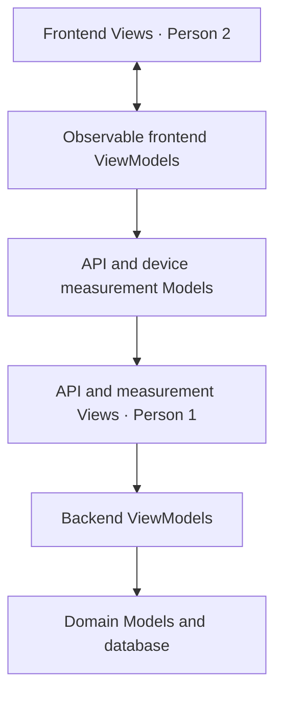
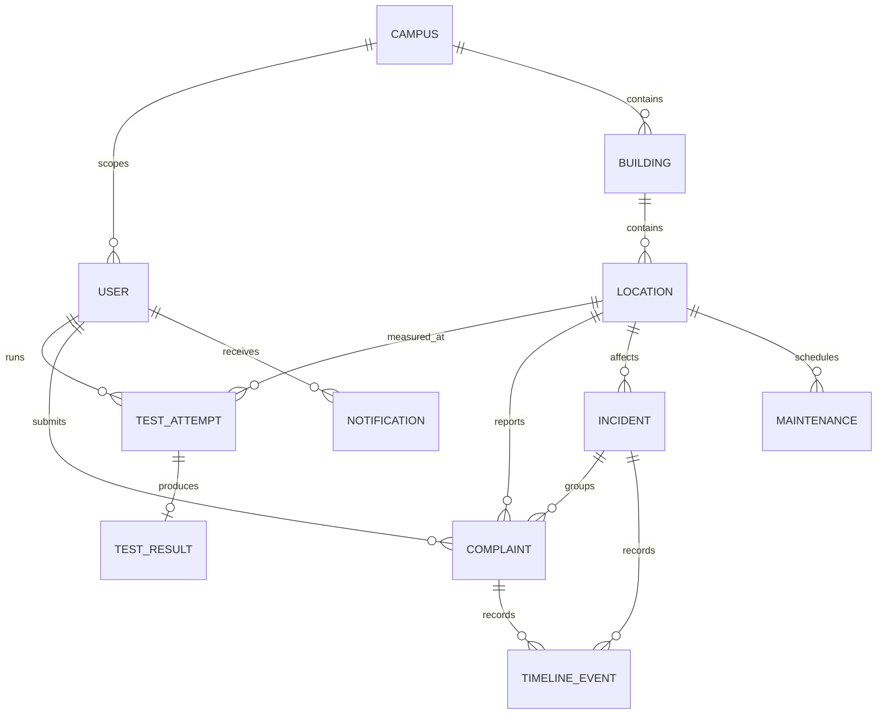

# MVVM architecture and ownership

The browser application follows presentation MVVM directly: Views bind observable state and invoke commands; ViewModels maintain state and orchestrate actions; Models make API requests and measure the device connection. The backend uses an MVVM adaptation: HTTP Views delegate to application ViewModels that manipulate the data/domain Model and return response read models.

| Layer | Rule | Example |
|---|---|---|
| Backend View | HTTP parsing/dependencies/serialization only | `app/views/complaints.py` forwards a transition to `ComplaintsViewModel` |
| Backend ViewModel | Application commands, validation/orchestration, response state | `app/viewmodels/complaints.py` enforces lifecycle and calls recovery/domain logic |
| Backend Model | ORM entities, contracts, algorithms and aggregates | `app/models/network.py` calculates score, location health and incident evidence |
| Frontend Model | Fetch/measure, no UI state | `integration/models/BrowserMeasurement.mjs` times device HTTP traffic |
| Frontend ViewModel | Observable state and commands, no rendering | `SpeedTestViewModel` controls progress/cancellation and retains pending saves |
| Frontend View | Render/bind/invoke commands | `ReactBinding.example.jsx` displays state with `useSyncExternalStore` |

Backend ViewModels are stateless across requests and receive a transaction-scoped SQLAlchemy session (unit of work). The ORM/database access is part of the Model interface; ViewModels orchestrate queries and use Model services for shared domain algorithms. Every request commits as one transaction after success or rolls back on failure; bounded measurement reservations/receipts deliberately use short atomic transactions around separate transfer traffic.

`security.py` and `db.py` are transport/infrastructure dependencies. Password/token helpers can be called by application ViewModels; authentication dependencies resolve the current principal for Views. `DomainError` is framework-independent and translated into HTTP errors at the View host.

Do not put scoring inside a React component or browser ViewModel: server-side scoring owns thresholds and versions. Do not put transfer timing in the backend: the browser Model measures the user's actual path. Never treat an HTTP ping failure as packet loss.

The architecture tests assert that normal API Views delegate rather than query the database, that backend ViewModels have no direct web-framework imports, and that an authentication ViewModel works without an HTTP request. The frontend tests exercise observable state, retries, cancellation and stale-response handling.

## Data relationships

Also stored: campus endpoints, immutable scoring threshold versions, revocable login sessions and audit events. Location and user deactivation preserve references. Test and complaint submission uniqueness protects retries. Incident `active_key` is nullable and unique, allowing at most one active incident per location while retaining old incidents.

## Scoring

Download subscore = `min(100, download / configured_target × 100)`; upload is analogous. Application RTT decreases linearly from 100 at the configured good latency to 0 at bad latency, clamped to 0–100. Weighted mean uses only available core metrics; at least two are needed. Weights default to 0.35/0.20/0.30 and are renormalized. Packet loss remains unmeasured. Bands: ≥90 excellent; ≥75 good; ≥50 fair; ≥25 poor; otherwise critical.

Reports expose raw sample averages and recent independent-user location medians separately. Scoring is calibrated configuration, not a universal guarantee of Wi-Fi quality. Historical results keep the version used at submission.

## Remaining optional features

Advanced AI prediction/classification models, packet-loss probes, signal telemetry, SSO, email/SMS and continuous network-agent monitoring need additional implementations/data. Current keyword classification, recurrence ranking, trend comparison and incident detection are explicitly rule-based and traceable to stored records.
